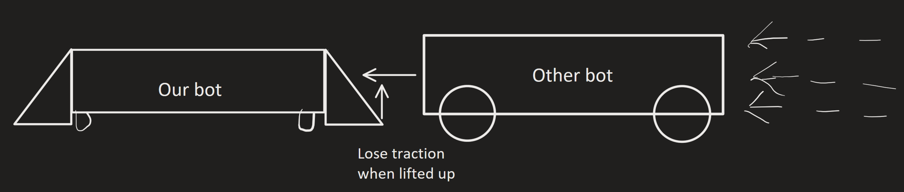
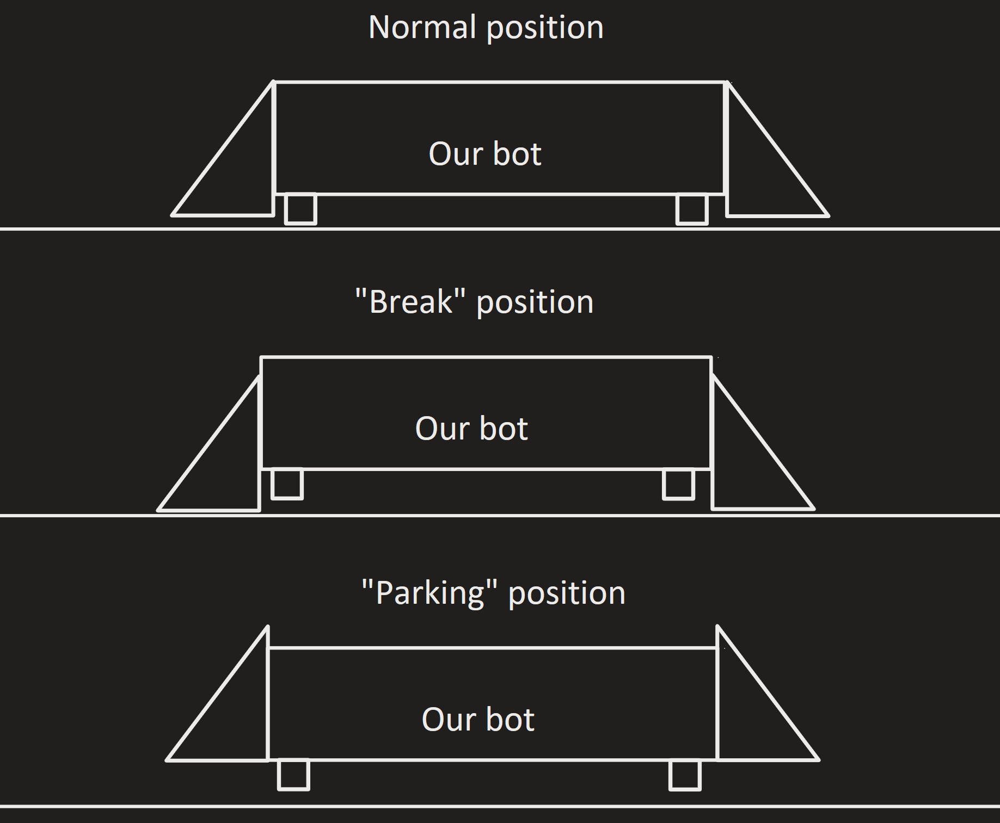

# Identify:
### Problem:
Our current bot can be pushed around more than I would like, we need a way to fix that.

# Brainstorm:
We need more traction and torque, mostly traction, as we cant really change torque as the speed is set in mostly dry clay.

Because speed (and torque is set) we need other solutions to help with pushing/being pushed.
Something that could help is adding angled skirts to edge of the drivetrain

 As shown in this diagram, if we have a slope on the edge of our bot if another bot tries to push us it would get lifted up losing the majority of its traction
 This also helps with pushing other bots, because when we go push someone else it will lift them up a little bit , making them lose their traction and pushing us into the ground giving us more traction (we might have a little bit of a hard time with traction because we are planning on making our robot light)

There is a problem with this however; to be most effective the skirts bust be close to the ground, and that will make it difficult to park, so we need a way to raise up the skirt, and if we add that ability, we might as well make it so we can push it into the ground making effectively immovable

~~This can also help with [Parking](parking.md); we could make it the same mechanism.~~ Better solutions in [Aligner](aligner.md)

# Legality:
Rule **GG17** states that *a Robot may not Hold an opposing Robot for more than a*
*3-count during the Driver Controlled Period.*

**Holding is defined as:**

*Holding - A Robot status; see rule < GG17 > for more information. Holding is legal until it exceeds the limits in < GG17 >. A Robot is considered to be Holding if it meets any of the following criteria during a Match:*
- *Trapping - Limiting the movement of an opponent Robot to a small or confined area of the Field, approximately the size of one foam field tile or less, without an avenue for escape. Note that if a Robot is not attempting to escape, it is not considered Trapped.*
- *Pinning - Preventing the movement of an opponent Robot through contact with the Field Perimeter, a Field Element, or another Robot.*
- *Lifting - **Controlling an opponent’s movements by raising or tilting the opponent’s Robot off of the foam tiles.** Preventing a Robot that is already off of the Floor from returning to the Floor may also be considered Lifting or Trapping.*

It is also mentioned that "*Holding is a **standard** and **legal** part of Head-to-Head game play, and only becomes a Violation if it exceeds the guidelines in this rule. By beginning a Holding count immediately after noticing a Holding interaction, and providing a visual signal when a Holding*
*interaction has been cleared, Head Referees can help Teams avoid penalties.*"

Therefore if we were to use a skirt/wedge to lift another robot it would just be considered *Holding* and is not directly illegal.